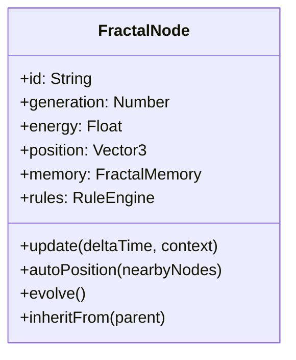
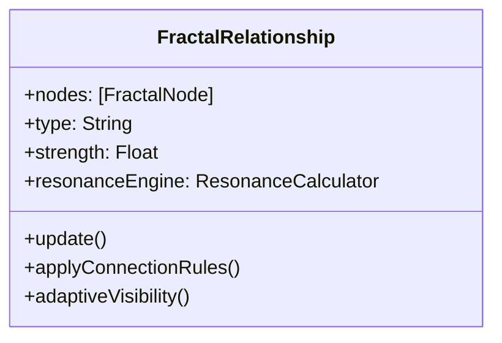
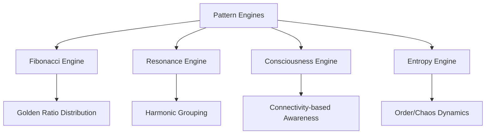
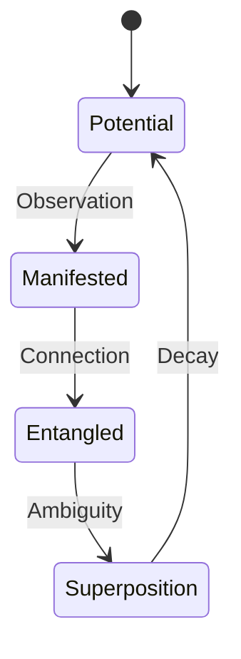

# Core 1: The Fractality Project - Intelligent Fractal Architecture

## Executive Summary
The Fractality Project is a revolutionary framework that leverages the inherent patterns of reality to create an efficient, self-organizing visualization system. By designing components that embody fractal principles, we transform cosmic patterns into computational advantages, resulting in a system that becomes more efficient as complexity increases.

## Fundamental Principles

### 1. The Fractal Universe as Engine
- **Core Insight**: The patterns of the Fractiverse aren't just visualized - they power the system
- **Recursive Symmetry**: Components at all scales follow identical rules
- **Self-Similar Efficiency**: Computation mirrors natural optimization patterns
- **Resonant Computation**: Leverages harmonic relationships for efficient processing

### 2. Intelligent Elements Philosophy
- **Autonomous Agents**: Each component manages its own complexity
- **Pattern Inheritance**: Entities inherit behaviors from their fractal ancestors
- **Energy Awareness**: Components conserve resources when not needed
- **Contextual Intelligence**: Elements adapt behavior to current view

### 3. Computational Resonance
- **Harmonic Processing**: Group similar-frequency elements together
- **Fractal Culling**: Automatically ignore insignificant branches
- **Generational Scaling**: Simplify representation at deeper levels
- **Pattern-Powered Calculation**: Use mathematical relationships as computation shortcuts

## Architectural Pillars

### 1. Smart Node System


**Key Capabilities**:
- Self-organizing positioning using Fibonacci patterns
- Energy-based activity levels (0.1-1.0 scale)
- Fractal memory inheritance from ancestors
- Autonomous evolution based on interactions

### 2. Relationship Intelligence


**Key Capabilities**:
- Auto-adjusting strength based on harmonic resonance
- Context-aware visibility (only renders when relevant)
- Pattern-enforced growth/decay mechanics
- Energy-based connection prioritization

### 3. Micro-Engines Framework


**Key Capabilities**:
- Specialized processors for fractal patterns
- Stateless, pure-function design
- Parallel processing capability
- Pattern-optimized algorithms

### 4. Recursive Rule System
```mermaid
flowchart TD
    A[Rule System] --> B[Self-Similarity]
    A --> C[Energy Flow]
    A --> D[Harmonic Attraction]
    B --> E[Scale = 1/φ^generation]
    C --> F[Energy Transfer = f(system, entity)]
    D --> G[Attraction ∝ 1/freq_diff]
```

**Key Rules**:
- `selfSimilarity`: Scale = 1 / φ^generation (φ = golden ratio)
- `energyFlow`: Dynamic energy redistribution
- `harmonicAttraction`: Frequency-based positioning
- `recursiveApplication`: Rules apply to all sub-components

### 5. Quantum-Inspired Systems


**Key Concepts**:
- **Probability Waves**: Visualizing potential states
- **Quantum Entanglement**: Instantaneous non-local connections
- **Superposition States**: Multiple simultaneous existences
- **Waveform Collapse**: Transition from potential to actual

## Computational Advantages

### Pattern-Optimized Processing
| Technique | Efficiency Gain | Implementation |
|-----------|-----------------|---------------|
| Fractal Culling | 70-90% reduction | Ignore branches below energy threshold |
| Resonance Grouping | 40-60% reduction | Process similar entities together |
| Generational Scaling | 50-80% reduction | Simplify distant generations |
| Lazy Computation | 30-50% reduction | Only calculate when visible/active |

### Emergent Efficiency Properties
1. **Self-Organizing Computation**: Processing load distributes automatically
2. **Energy-Based Optimization**: Resources focus where needed most
3. **Pattern Resonance**: Calculations align with natural mathematics
4. **Holographic Processing**: Parts contain information about the whole

## Implementation Strategy

### Phase 1: Fractal Core Engine (1-3 months)
1. Autonomous node/relationship prototypes
2. Recursive rule system
3. Fibonacci layout engine
4. Energy management core

### Phase 2: Pattern Optimization (4-6 months)
1. Fractal memory system
2. Resonance-based grouping
3. Energy conservation algorithms
4. Adaptive rendering pipeline

### Phase 3: Emergent Intelligence (7-9 months)
1. Evolutionary rule systems
2. Pattern-recognition engines
3. Self-organizing relationships
4. Predictive computation

### Phase 4: Quantum Extensions (10-12 months)
1. Probability wave visualization
2. Entanglement relationships
3. Superposition states
4. Quantum-inspired navigation

## Technical Foundations

### Fractal Rule System
```javascript
const fractalRules = {
  selfSimilarity: (entity, context) => {
    entity.scale = 1 / Math.pow(1.618, entity.generation);
  },
  
  energyFlow: (entity, context) => {
    const energyTransfer = 0.01 * (context.systemEnergy - entity.energy);
    entity.energy = Math.max(0.1, Math.min(1, entity.energy + energyTransfer));
  },
  
  harmonicAttraction: (entity, context) => {
    context.nearbyEntities.forEach(other => {
      if (Math.abs(entity.frequency - other.frequency) < 5) {
        const attraction = 0.1 * (1 - Math.abs(entity.frequency - other.frequency)/5);
        entity.position.add(
          other.position.clone().sub(entity.position).multiplyScalar(attraction)
        );
      }
    });
  },
  
  applyRecursive: (entity, context) => {
    // Apply to self
    Object.values(fractalRules).forEach(rule => {
      if (rule !== fractalRules.applyRecursive) rule(entity, context);
    });
    
    // Apply to children
    if (entity.children) {
      entity.children.forEach(child => 
        fractalRules.applyRecursive(child, {
          ...context,
          generation: context.generation + 1
        })
      );
    }
  }
};
```

### Resonance Calculation Engine
```javascript
class ResonanceCalculator {
  constructor() {
    this.harmonicCache = new Map();
  }

  calculate(freqDiff) {
    // Check cache first
    if (this.harmonicCache.has(freqDiff)) {
      return this.harmonicCache.get(freqDiff);
    }
    
    // Calculate resonance using fractal pattern
    const resonance = this.fibonacciResonance(freqDiff);
    
    // Cache result
    this.harmonicCache.set(freqDiff, resonance);
    return resonance;
  }

  fibonacciResonance(diff) {
    // Use golden ratio for harmonic calculation
    const phi = (1 + Math.sqrt(5)) / 2;
    return Math.pow(phi, -diff * 0.1);
  }
}
```

## Conclusion: The Fractal Computation Advantage
The Fractality Project transcends traditional visualization by creating a living computational ecosystem. This architecture achieves unprecedented efficiency by:

1. **Leveraging Cosmic Patterns**: Turning universal mathematics into computation
2. **Embracing Recursive Symmetry**: Simplicity begets complexity
3. **Implementing Energy Awareness**: Resources focus where needed
4. **Harnessing Resonance**: Harmonic relationships optimize processing

By mirroring nature's approach to complexity, the system becomes more efficient as it grows - precisely because it's built on the same principles that govern the universe's most complex systems.

---

# Core 2: Fractality Project - Implementation Blueprint

## 1. Smart Node Implementation
```javascript
class FractalNode {
  constructor(id, generation, parent = null) {
    this.id = id;
    this.generation = generation;
    this.parent = parent;
    this.children = [];
    this.connections = new Set();
    this.energy = 1.0;
    this.position = new THREE.Vector3();
    this.radius = 1.0;
    this.color = 0xffffff;
    this.frequency = 440; // Default frequency
    
    // Intelligence systems
    this.memory = new FractalMemory(this);
    this.ruleEngine = new RuleEngine(this);
    
    // Inherit from parent if exists
    if (parent) {
      this.inheritFrom(parent);
      parent.addChild(this);
    }
  }
  
  inheritFrom(parent) {
    // Copy fractal rules
    this.ruleEngine.inherit(parent.ruleEngine);
    
    // Inherit memory patterns
    this.memory.inheritPatterns(parent.memory);
    
    // Adjust properties based on generation
    this.radius = parent.radius * 0.618; // Golden ratio
    this.energy = parent.energy * 0.8;
    this.frequency = parent.frequency * (this.generation % 2 === 0 ? 1.5 : 0.67);
  }
  
  addChild(node) {
    this.children.push(node);
    this.connections.add(node);
    node.connections.add(this);
  }
  
  update(deltaTime, context) {
    // Conserve energy when not visible
    this.energy = context.isVisible(this) ? 1.0 : 0.1;
    
    // Apply fractal rules
    this.ruleEngine.apply(context);
    
    // Update position based on rules
    this.calculatePosition(context);
    
    // Update children recursively
    this.children.forEach(child => 
      child.update(deltaTime, {...context, generation: context.generation + 1})
    );
  }
  
  calculatePosition(context) {
    // Fibonacci-based positioning
    if (this.children.length > 0) {
      const phi = Math.PI * (3 - Math.sqrt(5));
      this.children.forEach((child, i) => {
        const y = 1 - (i / (this.children.length - 1)) * 2;
        const radius = Math.sqrt(1 - y * y);
        const theta = phi * i;
        child.position.set(
          Math.cos(theta) * radius * this.energy * 10,
          y * this.energy * 10,
          Math.sin(theta) * radius * this.energy * 10
        );
      });
    }
  }
  
  evolve() {
    // Increase complexity based on experiences
    if (this.memory.interactionCount > 10) {
      this.ruleEngine.addRule(new RelationshipRule());
      this.radius *= 1.2;
    }
    
    // Evolve children
    this.children.forEach(child => child.evolve());
  }
}
```

## 2. Fractal Memory System
```javascript
class FractalMemory {
  constructor(node) {
    this.node = node;
    this.patterns = [];
    this.interactionCount = 0;
    this.ancestralPatterns = [];
  }
  
  inheritPatterns(parentMemory) {
    // Copy parent's patterns with generational decay
    this.patterns = parentMemory.patterns.map(pattern => ({
      ...pattern,
      strength: pattern.strength * 0.7
    }));
    
    // Store ancestral patterns separately
    this.ancestralPatterns = [
      ...parentMemory.ancestralPatterns,
      ...this.patterns
    ].filter(p => p.strength > 0.1);
  }
  
  recordInteraction(node) {
    this.interactionCount++;
    
    // Detect new patterns
    const pattern = this.detectPattern(node);
    if (pattern) {
      this.addPattern(pattern);
    }
  }
  
  detectPattern(node) {
    // Simple pattern detection - harmonic resonance
    const freqDiff = Math.abs(this.node.frequency - node.frequency);
    return freqDiff < 5 ? { 
      type: 'harmonic', 
      strength: 1 - freqDiff/5,
      frequency: (this.node.frequency + node.frequency)/2 
    } : null;
  }
  
  addPattern(pattern) {
    // Check for existing similar patterns
    const existing = this.patterns.find(p => 
      p.type === pattern.type && 
      Math.abs(p.frequency - pattern.frequency) < 2
    );
    
    if (existing) {
      // Strengthen existing pattern
      existing.strength = Math.min(1, existing.strength + 0.1);
    } else {
      // Add new pattern
      this.patterns.push(pattern);
    }
  }
  
  getRelevantPatterns(context) {
    // Return patterns above threshold, sorted by relevance
    return [...this.patterns, ...this.ancestralPatterns]
      .filter(p => p.strength > 0.3)
      .sort((a, b) => b.strength - a.strength);
  }
}
```

## 3. Rule Engine Implementation
```javascript
class RuleEngine {
  constructor(node) {
    this.node = node;
    this.rules = [];
    this.defaultRules = [
      new EnergyConservationRule(),
      new HarmonicAttractionRule()
    ];
  }
  
  inherit(parentEngine) {
    // Copy rules with generational weakening
    this.rules = parentEngine.rules.map(rule => 
      rule.cloneWithWeight(rule.weight * 0.8)
    );
  }
  
  addRule(rule) {
    this.rules.push(rule);
  }
  
  apply(context) {
    // Apply default rules first
    this.defaultRules.forEach(rule => rule.execute(this.node, context));
    
    // Apply custom rules above weight threshold
    this.rules.forEach(rule => {
      if (rule.weight > 0.2) {
        rule.execute(this.node, context);
      }
    });
  }
}

// Base rule class
class FractalRule {
  constructor(weight = 1.0) {
    this.weight = weight;
  }
  
  execute(node, context) {
    // To be implemented by specific rules
  }
  
  cloneWithWeight(newWeight) {
    const clone = new this.constructor(newWeight);
    Object.assign(clone, this);
    clone.weight = newWeight;
    return clone;
  }
}

// Concrete rule implementations
class EnergyConservationRule extends FractalRule {
  execute(node, context) {
    const energyTransfer = 0.01 * (context.systemEnergy - node.energy);
    node.energy = Math.max(0.1, Math.min(1, node.energy + energyTransfer));
  }
}

class HarmonicAttractionRule extends FractalRule {
  execute(node, context) {
    context.nearbyNodes.forEach(other => {
      if (Math.abs(node.frequency - other.frequency) < 5) {
        const attraction = this.weight * 0.1 * 
          (1 - Math.abs(node.frequency - other.frequency)/5);
        
        const direction = other.position.clone()
          .sub(node.position)
          .normalize();
          
        node.position.add(direction.multiplyScalar(attraction));
      }
    });
  }
}

class RelationshipRule extends FractalRule {
  execute(node, context) {
    // Automatically form connections based on patterns
    const patterns = node.memory.getRelevantPatterns(context);
    
    patterns.forEach(pattern => {
      const potentialPartners = context.nearbyNodes.filter(n => 
        Math.abs(n.frequency - pattern.frequency) < 3
      );
      
      potentialPartners.forEach(partner => {
        if (!node.connections.has(partner)) {
          node.addConnection(partner);
          node.memory.recordInteraction(partner);
        }
      });
    });
  }
}
```

## 4. Resonance Engine
```javascript
class ResonanceEngine {
  constructor() {
    this.harmonicGroups = new Map();
    this.groupCache = new Map();
  }
  
  update(nodes) {
    this.calculateHarmonicGroups(nodes);
    this.calculateIntraGroupResonance();
  }
  
  calculateHarmonicGroups(nodes) {
    this.harmonicGroups.clear();
    
    // Group by harmonic frequencies
    nodes.forEach(node => {
      const harmonic = Math.round(node.frequency / 10) * 10;
      
      if (!this.harmonicGroups.has(harmonic)) {
        this.harmonicGroups.set(harmonic, []);
      }
      
      this.harmonicGroups.get(harmonic).push(node);
    });
    
    // Cache group membership for quick lookup
    this.groupCache.clear();
    this.harmonicGroups.forEach((group, harmonic) => {
      group.forEach(node => {
        this.groupCache.set(node.id, {
          harmonic,
          nodes: group
        });
      });
    });
  }
  
  calculateIntraGroupResonance() {
    this.harmonicGroups.forEach(group => {
      const groupSize = group.length;
      
      group.forEach(node => {
        // Resonance strength proportional to group size
        node.resonance = groupSize / 50; // Normalized
        
        // Positional harmony - move toward group center
        if (groupSize > 1) {
          const center = new THREE.Vector3();
          group.forEach(n => center.add(n.position));
          center.divideScalar(groupSize);
          
          const moveDirection = center.sub(node.position).normalize();
          node.position.add(moveDirection.multiplyScalar(0.05 * node.resonance));
        }
      });
    });
  }
  
  getGroupForNode(nodeId) {
    return this.groupCache.get(nodeId) || null;
  }
}
```

## 5. Quantum State System
```javascript
class QuantumStateSystem {
  constructor() {
    this.entangledGroups = [];
    this.probabilityFields = new Map();
  }
  
  addProbabilityField(node, states) {
    this.probabilityFields.set(node.id, {
      node,
      states: new Map(states),
      collapsedState: null
    });
  }
  
  collapseField(nodeId) {
    const field = this.probabilityFields.get(nodeId);
    if (!field) return;
    
    let total = 0;
    let random = Math.random();
    let selectedState = null;
    
    // Collapse based on probability distribution
    for (const [state, probability] of field.states) {
      total += probability;
      if (random <= total) {
        selectedState = state;
        break;
      }
    }
    
    field.collapsedState = selectedState;
    return selectedState;
  }
  
  entangleNodes(nodeIds) {
    const group = {
      nodes: nodeIds,
      collapsed: false
    };
    
    this.entangledGroups.push(group);
    return group;
  }
  
  collapseEntangledGroup(group) {
    if (group.collapsed) return;
    
    // Collapse all nodes to same state
    const state = this.collapseField(group.nodes[0]);
    
    group.nodes.forEach(nodeId => {
      const field = this.probabilityFields.get(nodeId);
      if (field) {
        field.collapsedState = state;
      }
    });
    
    group.collapsed = true;
  }
  
  update(deltaTime) {
    // Apply quantum evolution to probability fields
    this.probabilityFields.forEach(field => {
      if (!field.collapsed) {
        // Evolve probabilities
        const newStates = new Map();
        let total = 0;
        
        for (const [state, prob] of field.states) {
          // Simple evolution: more probable states increase
          const newProb = Math.min(1, prob * 1.01);
          newStates.set(state, newProb);
          total += newProb;
        }
        
        // Renormalize
        for (const [state, prob] of newStates) {
          newStates.set(state, prob / total);
        }
        
        field.states = newStates;
      }
    });
    
    // Handle entanglement groups
    this.entangledGroups.forEach(group => {
      if (!group.collapsed && Math.random() < 0.01) {
        this.collapseEntangledGroup(group);
      }
    });
  }
}
```

