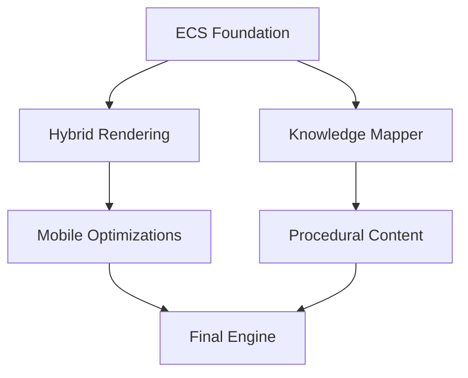

# Fractality Engine - Technical Roadmap v1.0

> **Mobile-First Hybrid Engine for Knowledge-Based Gaming**  
> *Blending ontology visualization with immersive 3D RPG gameplay*

## Core Architecture


## Phase 1: Engine Foundation (8 Weeks)
### ECS Implementation (Rust/WASM)
```rust
// SoA memory layout for mobile
#[derive(Component, Default)]
struct NodePhysics {
    positions: Vec<[f32; 3]>,
    velocities: Vec<[f32; 3]>
}

// Knowledge component
#[derive(Component)]
struct OntologyNode {
    id: u64,
    node_type: NodeType, // CONCEPT, ENTITY, RELATION
    energy: f32,
    connections: Vec<Entity>
}
```

### Hybrid Rendering Pipeline
- **WebGL 2.0** base renderer
- **WebGPU** fallback detection
- Smart Node GI shader:
```glsl
vec3 calculateMobileGI(vec3 pos, vec3 normal) {
    vec3 gi = vec3(0.0);
    for (int i = 0; i < MAX_SMART_NODES; i++) {
        if (nodeImportance[i] > THRESHOLD) {
            vec3 dir = normalize(nodePos[i] - pos);
            float ndotl = max(dot(normal, dir), 0.0);
            gi += nodeColor[i] * ndotl / distanceSq;
        }
    }
    return gi;
}
```

## Phase 2: Knowledge Integration (8 Weeks)
### Ontology Transformation
```python
def node_to_gameobject(node):
    if node.type == "CONCEPT":
        return create_environment(node)
    elif "COMBAT" in node.tags:
        return create_battle_arena(node)
    elif node.connections > 5:
        return create_hub_area(node)

# AI-assisted content
from transformers import pipeline
quest_generator = pipeline('text2text-generation', model='t5-small')
def generate_quest(node):
    return quest_generator(f"Create RPG quest about {node.name}:")[0]
```

### Dynamic Physics System
```glsl
// Conceptual gravity shader
vec3 knowledgeForce(vec3 position) {
    vec3 force = vec3(0.0);
    for (int i = 0; i < NODE_COUNT; i++) {
        vec3 dir = nodes[i].position - position;
        float influence = nodes[i].energy * pow(length(dir), -2.0);
        force += dir * influence;
    }
    return force * 0.01;
}
```

## Phase 3: Mobile Optimization (8 Weeks)
### Thermal Management
```javascript
// Dynamic quality scaling
navigator.thermal.addEventListener('thermalchange', () => {
    if (navigator.thermal.state === 'critical') {
        engine.setQualityLevel('LOW');
        engine.disableRayTracing();
    }
});
```

### Touch Interface
```typescript
class GestureSystem {
    private gestures = new Map<string, Function>();
    
    registerGesture(name: string, handler: Function) {
        this.gestures.set(name, handler);
    }

    handleTouch(event: TouchEvent) {
        // Implement pinch/swipe/long-press detection
    }
}
```

## Performance Targets
| System                  | Target (Mid-range Mobile) | Measurement             |
|-------------------------|---------------------------|-------------------------|
| Frame Time              | ≤16ms (60fps)            | WebGPU Profiler         |
| Memory Usage            | ≤150MB                   | Android Memory Monitor  |
| Mode Transition         | <300ms                   | Custom Perf Timer       |
| Ray Tracing Cost        | ≤2ms/frame              | RenderDoc               |

## Immediate Next Steps
1. **Set Up Benchmarking**
```bash
npm install --save-dev webgpu-profiler
npx webgpu-profiler init
```

2. **Core Rendering MVP**
- Implement WebGL 2.0 renderer
- Create 5 smart node prototypes
- Basic ECS entity system

3. **Sample Content Pipeline**
```json
{
  "nodes": [
    {
      "id": "math_001",
      "type": "CONCEPT",
      "position": [0,5,0],
      "energy": 0.7,
      "tags": ["geometry", "puzzle"]
    }
  ]
}
```

## Innovation Focus
### Neural Denoising (TensorFlow.js)
```javascript
import * as tf from '@tensorflow/tfjs';
const model = await tf.loadGraphModel('mobile_denoiser.qint8');

function enhanceFrame(frame) {
    const tensor = tf.browser.fromPixels(frame);
    return model.execute(tensor);
}
```

### Predictive Streaming
```python
# AI-driven asset loading
def predict_assets(current_node):
    return gpt.predict(f"Based on {current_node.name}, what 3D assets might be needed next?")
```

---
