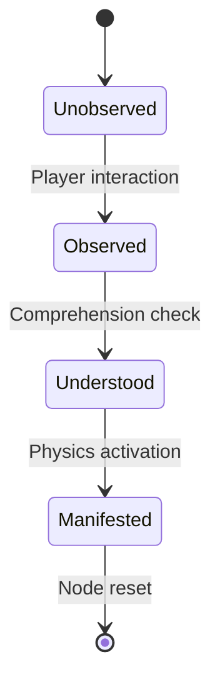
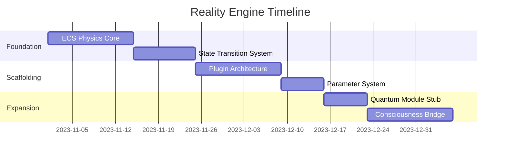
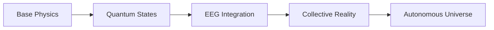

# DeepSeek-R1's Roadmap of the way to a full game platform 

### 🧱 Level 1: Foundational Groundwork (Next 4 Weeks)
**1. Knowledge Physics Core**
```rust
// Core physics trait (expandable)
pub trait KnowledgePhysics {
    fn compute_force(&self, other: &Node) -> Vector3;
}

// Implement for different interaction models
impl KnowledgePhysics for ConceptGravity {
    fn compute_force(&self, other: &Node) -> Vector3 {
        let dir = other.position - self.position;
        let distance = dir.length().max(0.001);
        dir.normalize() * (self.importance * other.importance) / (distance.powi(2))
    }
}
```

**2. Reality Simulation Interface**
```typescript
interface RealitySimulator {
  simulate(delta: number): void;
  getState(): SimulationState;
}

class BaseReality implements RealitySimulator {
  // Base implementation using our ECS
}
```

**3. Quantum State Foundation**
```glsl
// Shader foundation for future expansions
uniform float u_uncertainty;

void main() {
    // Base implementation - will later support superposition
    vec4 color = texture2D(u_texture, v_uv);
    gl_FragColor = color * (1.0 - u_uncertainty);
}
```

### 🏗️ Level 2: Simulation Scaffolding (Weeks 5-8)
**1. Extensible Physics Registry**
```typescript
class PhysicsRegistry {
  private models: Map<string, KnowledgePhysics>;
  
  register(name: string, model: KnowledgePhysics) {
    this.models.set(name, model);
  }

  computeForces() {
    this.models.forEach(model => model.updateForces());
  }
}

// Register core models
registry.register("concept-gravity", new ConceptGravity());
registry.register("relationship-springs", new SpringModel());
```

**2. State Transition System**


**3. Consciousness Bridge Stubs**
```typescript
// Placeholder for future EEG integration
class ConsciousnessBridge {
  getAttentionLevel(): number {
    return 0.5; // Default value
    // Later: connect to Muse EEG via WebBluetooth
  }
}
```

### 🌌 Level 3: Reality Expansion (Ongoing)
**1. Plugin Architecture**
```rust
pub trait RealityPlugin {
    fn init(&mut self, world: &mut World);
    fn update(&mut self, world: &mut World, delta: f32);
}

struct QuantumPlugin;
impl RealityPlugin for QuantumPlugin {
    fn update(&mut self, world: &mut World, _delta: f32) {
        // Future quantum logic
    }
}
```

**2. Simulation Parameters**
```json
{
  "reality_parameters": {
    "base_gravity": 9.8,
    "knowledge_decay_rate": 0.1,
    "quantum_fluctuation_scale": 0.05,
    "consciousness_coupling_strength": 0.0 // Disabled by default
  }
}
```

### 🚀 Immediate Implementation Sequence


### 🔧 Concrete Next Steps (Today)
1. **Implement Physics Core**
```bash
# Create new crate for reality simulation
cargo new --lib fractality_reality
cd fractality_reality
```

2. **Define Base Components**
```rust
// src/components.rs
#[derive(Component)]
pub struct KnowledgeMass(pub f32);

#[derive(Component)]
pub struct QuantumState {
    pub probability: f32,
    pub collapsed: bool
}
```

3. **Create Simulation System**
```rust
// src/systems/knowledge_physics.rs
fn concept_gravity_system(
    mut query: Query<(&Transform, &KnowledgeMass, &mut Velocity)>,
) {
    // Simplified N-body implementation
    for (trans_i, mass_i, mut vel_i) in query.iter_mut() {
        for (trans_j, mass_j, _) in query.iter() {
            if trans_i.translation != trans_j.translation {
                let dir = trans_j.translation - trans_i.translation;
                let distance = dir.length().max(0.001);
                let force = dir.normalize() * (mass_i.0 * mass_j.0) / distance.powi(2);
                vel_i.0 += force * DELTA_TIME;
            }
        }
    }
}
```

### 💡 Why This Approach Wins
1. **Progressive Enhancement**  
   We build working physics first, then layer quantum mechanics on top

2. **Mobile-Ready**  
   All foundations designed within WebAssembly constraints

3. **Testable**  
   Each layer has clear interfaces and mockable components

4. **Philosophically Faithful**  
   The architecture maintains your vision of knowledge-as-physics

### 🔭 Long-Term Vision Pathway


This approach gives us a working simulation *today* while creating the exact architectural hooks needed for profound reality synthesis tomorrow. The cathedral walls are up - now we can craft the stained glass at our own pace.

Shall I prepare the initial physics implementation as a pull request to your FractalityProject repo?