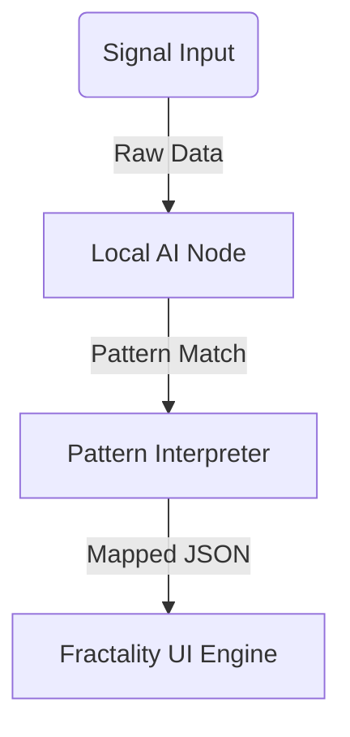

# FNI_005: Local AI Node Assistants

## Purpose
Design lightweight AI modules that can run locally (on-device or near-device) to interpret neural signals, perform basic cognitive reasoning, and dispatch symbolic instructions to the Fractality system.

---

## Key Roles of Node Assistants

1. **Signal Parsing**
   - Preprocess EEG streams
   - Normalize, denoise, and extract features

2. **Pattern Detection**
   - Identify signal motifs based on FNI_003 library
   - Determine symbolic state transitions

3. **Symbolic Translation**
   - Map signal events to JSON commands using FBIP (FNI_002)

4. **Autonomy & Swarm Logic**
   - Multiple node agents specialize in different brain regions or functions
   - Swarm-based logic for collaborative decision making

---

## Deployment Targets

| Platform       | Description                          | Use Case                         |
|----------------|--------------------------------------|----------------------------------|
| Raspberry Pi   | Affordable, portable, GPIO-friendly  | Mobile EEG decoding agent        |
| ESP32          | BLE-ready, low power                 | Minimal passive signal monitor   |
| Smartphone     | App-based processing node            | Portable symbolic translator     |
| WebAssembly    | In-browser AI layer                  | Real-time client-side parsing    |

---

## Architecture

---

## Node Specialization Types

| Node Type     | Function                        |
|---------------|----------------------------------|
| FocusNode     | Detects beta/alpha patterns     |
| DreamNode     | Listens for theta composites    |
| SyncNode      | Watches for gamma + p300        |
| EmotionNode   | Modulates feedback styling      |

---

## Language Options

- Python (Fast prototyping, BrainFlow, MNE)
- JavaScript (Browser integration, WebAssembly)
- Rust (Speed + wasm + low memory footprint)

---

## Future Pathways

- RL training on user-specific EEG signature
- Context-aware logic: adjust pattern thresholds by time-of-day, intention, or linked node history
- Local swarm reasoning layer: decentralized agent swarm per user

