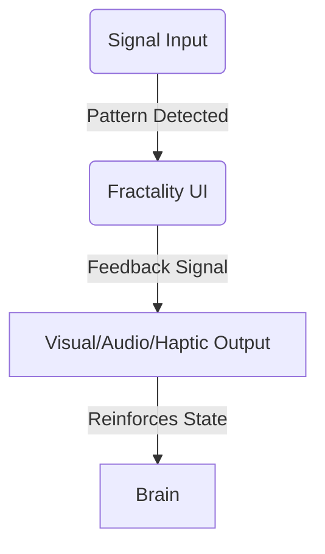

# FNI_006: Biofeedback Loop Design

## Purpose
Define a closed-loop architecture in which the Fractality system responds to brain input with real-time visual, audio, or haptic feedback to reinforce specific mental states or symbolic trajectories.

---

## Feedback Types

| Feedback Modality | Description                            | Example                          |
|-------------------|----------------------------------------|----------------------------------|
| Visual            | Light intensity, color, motion         | Node pulse, trail shimmer        |
| Audio             | Ambient tone, chime, binaural beat     | Gamma sync → bell sweep          |
| Haptic            | Device vibration, muscle twitch        | Beta spike → double-tap          |
| Environmental     | Smart lights, room ambiance            | Theta drift → dim room lighting  |

---

## Loop Structure

---

## Use Case Examples

1. **Creative Loop**
   - Theta detected → Trail Divergence generated
   - Dreamy visuals + ambient synth tone triggered
   - Encourages deeper ideation

2. **Focus Loop**
   - Alpha/Beta match → Node is locked/focused
   - Pulsing node + binaural focus tone
   - Sustains user attention

3. **Emotional Integration**
   - HRV coherence → Calm node color + smooth animation
   - Distress → Gentle correction tone, UI contraction

---

## Future Expansion

- Integrate with neuroadaptive music or AI-generated visuals
- Adaptive feedback models based on real-time EEG shifts
- Optional user override (consent → override loop behavior)

