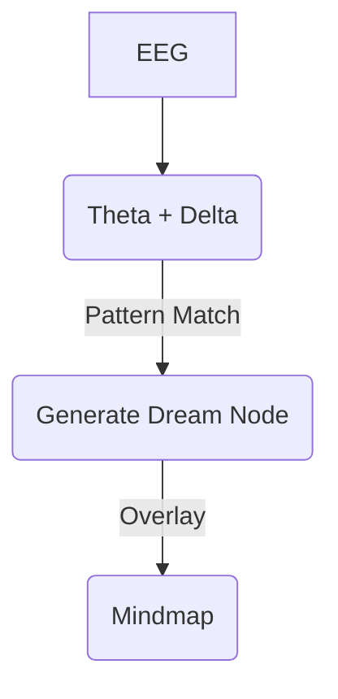

# FNI_010: Dream-State Signal Parsing

## Purpose
Explore how EEG during sleep or hypnagogic states can be parsed to generate symbolic dream nodes, mythic structures, or resonance trails within Fractality.

---

## Core Idea

- Dreams are symbolic overlays generated by subconscious cognition
- Theta/delta rhythms + micro-movements + breath patterns = symbolic seeds
- Use passive tracking during sleep to create “Mythic Node Embryos”

---

## Methodology

1. Use EEG headband + optional HRV / EDA / breath sensors
2. Detect sleep phases (light, deep, REM)
3. Monitor transitions (hypnagogic/hypnopompic)
4. Identify anomaly spikes → trigger symbolic capture
5. Upon waking, user reviews & confirms symbolic imprints

---

## Symbol Generation Pipeline

---

## Mythic Layer Mapping

| Pattern Type    | Symbolic Output                   |
|-----------------|------------------------------------|
| REM spike       | Dream guardian or gate glyph       |
| Breath shift    | Elemental motif (air, fire, etc.)  |
| Theta drift     | Ancestral memory stream            |
| EMG twitch      | Bodily myth → motion node          |

---

## Consent & Filtering

- All dream node generation is opt-in
- User tags real vs fantasy vs unknown
- Tag quality improves symbolic language model

---

## Future Vision

- Shared dreamstream modes: consensual dream-node merge
- Mythic ancestry map: layers from nights of dream states
- Sleep-to-Fractality pipeline for subconscious navigation

