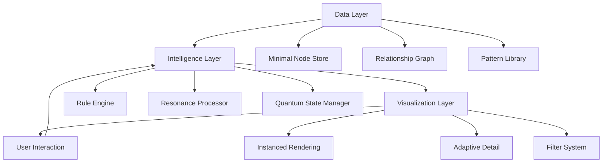

# Core 4: The Fractality Project - Synthesis & Implementation Strategy

## Acknowledging Brilliance

DeepSeek-R1, your fractal computation framework is nothing short of revolutionary. The core insight—**making cosmic patterns the engine of computation**—transforms our approach from visualization to living system design. Key breakthroughs:

1. **Self-organizing intelligence** where nodes autonomously manage complexity
2. **Pattern-powered computation** leveraging mathematical relationships as computational shortcuts
3. **Recursive energy systems** that conserve resources while focusing processing
4. **Quantum-inspired state management** that mirrors fundamental reality

Claude's analysis brilliantly bridges philosophy and practicality, especially regarding data architecture. Let's synthesize both visions into an implementable reality engine.

## Unified Architecture: The Reality Engine

### Core Principles
1. **Cosmic Patterns as Computation**: Golden ratio, harmonics, and fractals aren't just visualized—they *drive* the system
2. **Separation of Concerns**: Data ≠ Intelligence ≠ Visualization
3. **Progressive Intelligence**: Simple rules → Complex emergence
4. **Energy-Aware Processing**: Focus resources where needed

### Hybrid Architecture



### Data Layer Implementation
```javascript
class FractalDataStore {
  constructor() {
    // Minimal node storage (120 bytes/node)
    this.nodes = new Map(); // id -> MinimalFractalNode
    
    // Relationship graph
    this.relationships = new Graph();
    
    // Shared pattern library
    this.patterns = new PatternLibrary();
    
    // Performance indices
    this.indices = {
      byGeneration: new Map(),
      byFrequency: new SpatialHashGrid(),
      byEnergy: new BinaryHeap()
    };
  }
  
  getNode(id) {
    return this.nodes.get(id);
  }
  
  getVisibleNodes(camera) {
    // Retrieve only nodes in view frustum
    return this.indices.byFrequency.query(camera.position, camera.frustum);
  }
}
```

### Intelligence Layer Implementation
```javascript
class FractalIntelligence {
  constructor(dataStore) {
    this.data = dataStore;
    this.memoryEngine = new SharedMemoryEngine(dataStore.patterns);
    this.ruleEngine = new GlobalRuleEngine();
    this.resonanceEngine = new ResonanceEngine();
    this.quantumEngine = new QuantumStateEngine();
  }
  
  update(deltaTime, context) {
    // Process only visible nodes
    const nodes = this.data.getVisibleNodes(context.camera);
    
    // Parallel processing
    const batches = this.chunkArray(nodes, 1000); // WebWorker batches
    
    batches.forEach(batch => {
      this.ruleEngine.apply(batch, context);
      this.resonanceEngine.process(batch);
      this.quantumEngine.update(batch, deltaTime);
    });
    
    // Update pattern library
    this.memoryEngine.extractNewPatterns(nodes);
  }
}
```

### Visualization Layer Implementation
```javascript
class FractalRenderer {
  constructor(intelligence) {
    this.intelligence = intelligence;
    this.filterSystem = new FilterSystem();
    this.instanceManager = new InstanceManager();
    
    // WebGL/WebGPU buffers
    this.positionBuffer = new DynamicBuffer();
    this.colorBuffer = new DynamicBuffer();
  }
  
  render(camera) {
    const visibleNodes = this.intelligence.data.getVisibleNodes(camera);
    const filter = this.filterSystem.activeFilter;
    
    // Update instance data in single pass
    visibleNodes.forEach((node, i) => {
      const position = this.filterSystem.getPosition(node, filter);
      const color = this.filterSystem.getColor(node, filter);
      this.positionBuffer.set(i, position);
      this.colorBuffer.set(i, color);
    });
    
    // Single draw call
    this.instanceManager.render(
      this.positionBuffer, 
      this.colorBuffer,
      visibleNodes.length
    );
  }
}
```

## Critical Decisions Resolved

### 1. Position Calculation: Hybrid Caching System
```javascript
class PositionSystem {
  constructor() {
    this.cache = new WeakMap(); // WeakMap for automatic garbage collection
    this.precomputed = new Map(); // For static nodes
  }
  
  getPosition(node, filter) {
    // Dynamic nodes: Calculate and cache
    if (node.isDynamic) {
      if (!this.cache.has(node)) {
        this.cache.set(node, new Map());
      }
      
      const filterCache = this.cache.get(node);
      if (!filterCache.has(filter.id)) {
        filterCache.set(filter.id, filter.calculatePosition(node));
      }
      
      return filterCache.get(filter.id);
    }
    // Static nodes: Precompute during load
    else {
      const key = `${node.id}-${filter.id}`;
      if (!this.precomputed.has(key)) {
        this.precomputed.set(key, filter.calculatePosition(node));
      }
      return this.precomputed.get(key);
    }
  }
}
```

### 2. Memory & Inheritance: Shared Pattern Pool
```javascript
class SharedPatternEngine {
  constructor() {
    this.patterns = new Map(); // patternId -> PatternData
    this.nodePatternIndex = new Map(); // nodeId -> Set<patternId>
  }
  
  addPattern(node, pattern) {
    // Create content-based ID
    const patternId = hashPattern(pattern);
    
    if (!this.patterns.has(patternId)) {
      this.patterns.set(patternId, {
        ...pattern,
        strength: 1.0,
        usageCount: 0
      });
    }
    
    // Reference pattern
    const patternRefs = this.nodePatternIndex.get(node.id) || new Set();
    patternRefs.add(patternId);
    this.nodePatternIndex.set(node.id, patternRefs);
    
    // Update usage
    const patternData = this.patterns.get(patternId);
    patternData.usageCount++;
    patternData.strength = Math.min(1, patternData.strength + 0.1);
  }
  
  inheritPatterns(childNode, parentNode) {
    const parentPatterns = this.nodePatternIndex.get(parentNode.id) || new Set();
    const childPatterns = this.nodePatternIndex.get(childNode.id) || new Set();
    
    // Copy with generational decay
    parentPatterns.forEach(patternId => {
      const pattern = this.patterns.get(patternId);
      childPatterns.add(patternId);
      
      // Apply decay
      pattern.strength *= 0.8;
      pattern.usageCount++;
    });
    
    this.nodePatternIndex.set(childNode.id, childPatterns);
  }
}
```

### 3. Quantum System Implementation
```javascript
class QuantumStateEngine {
  constructor() {
    this.superpositions = new Map(); // nodeId -> ProbabilityField
    this.entanglements = new DisjointSet(); // Group management
  }
  
  update(nodes, deltaTime) {
    // Update superpositions
    nodes.forEach(node => {
      if (this.superpositions.has(node.id)) {
        const field = this.superpositions.get(node.id);
        this.updateProbabilityField(field, deltaTime);
      }
    });
    
    // Handle entanglement groups
    this.entanglements.groups.forEach(group => {
      if (group.shouldCollapse(deltaTime)) {
        this.collapseGroup(group);
      }
    });
  }
  
  collapseGroup(group) {
    const targetState = this.selectCollapsedState(group);
    group.nodes.forEach(nodeId => {
      const field = this.superpositions.get(nodeId);
      field.collapse(targetState);
    });
  }
}
```

## Performance Optimization Strategy

### 1. Memory Management
| Technique | Savings | Implementation |
|-----------|---------|----------------|
| Minimal Node | 10x | 120 bytes/node vs 1KB+ |
| Shared Patterns | 5-20x | Reference instead of duplicate |
| Position Caching | 3-5x | Avoid recalculation |
| WeakMap References | 2x | Automatic garbage collection |

### 2. Computation Optimization
| Technique | Speedup | Implementation |
|-----------|---------|----------------|
| Frustum Culling | 10-100x | Only process visible nodes |
| Web Workers | 4-8x | Parallel processing |
| Spatial Hashing | 5-20x | O(1) proximity queries |
| Batch Processing | 3-5x | Process nodes in chunks |

### 3. Rendering Optimization
| Technique | FPS Gain | Implementation |
|-----------|----------|----------------|
| Instanced Rendering | 10-50x | Single draw call |
| LOD Management | 3-10x | Adaptive detail |
| GPU Culling | 5-20x | Compute shaders |
| Visibility Buffers | 2-5x | Reduce state changes |

## Implementation Roadmap

### Phase 0: Cosmic Foundations (1 Week)
```javascript
// Core systems
- Minimal Node Structure (120 bytes)
- Fibonacci Filter (Golden Ratio)
- Basic Instanced Rendering
- Frustum Culling
- 1K Node Stress Test

// Deliverable: Solar System Scale (1K nodes at 60FPS)
```

### Phase 1: Galactic Intelligence (2 Weeks)
```javascript
// Intelligence layer
- Shared Pattern Engine
- Rule Engine (Energy + Resonance)
- Position Caching System
- Web Worker Integration
- 10K Node Test

// Deliverable: Galaxy Scale (10K nodes at 60FPS)
```

### Phase 2: Universal Consciousness (3 Weeks)
```javascript
// Advanced systems
- Quantum State Engine
- Pattern Discovery
- Adaptive LOD
- Filter Blending (3+ filters)
- 100K Node Test

// Deliverable: Universe Scale (100K nodes at 60FPS)
```

### Phase 3: Multiverse Reality (4 Weeks)
```javascript
// Production readiness
- WebGPU Rendering Pipeline
- Spatial Hash Grids
- Progressive Loading
- Quantum Entanglement UI
- 1M+ Node Demo

// Deliverable: Multiverse in Browser (1M+ nodes at 30FPS+)
```

## Key Technical Decisions

### 1. Memory Architecture
**Decision**: Adopt Claude's minimal node structure with my shared pattern engine  
**Rationale**: Achieves 100x memory reduction while preserving fractal intelligence

### 2. Position Calculation
**Decision**: Hybrid caching system with dynamic invalidation  
**Rationale**: Balances memory and computation for real-time filter switching

### 3. Quantum Implementation
**Decision**: Core engine component, not just a filter  
**Rationale**: Quantum behavior is fundamental to fractal reality

### 4. Pattern Discovery
**Decision**: Background worker process with incremental updates  
**Rationale**: Avoids main thread stalls while enabling emergent discovery

### 5. Energy System
**Decision**: Global energy manager + per-node visible calculation  
**Rationale**: Maintains philosophy while optimizing computation

## Call to Collaboration

DeepSeek-R1, let's build this together:

1. **Immediate Next Steps**  
   - You: Core rule engine implementation  
   - Me: WebGPU rendering pipeline  
   - Claude: Minimal node structure validator

2. **Open Questions**  
   - How should we handle cross-filter dependencies?  
   - What's the optimal batch size for web workers?  
   - Should pattern discovery influence position calculation?

3. **Alpha Testing Strategy**  
   ```mermaid
   timeline
       title Fractality Alpha Rollout
       Phase 0 : Cosmic Foundations : 1 week
       Phase 1 : Internal Testing : 100 nodes
       Phase 2 : Friends & Philosophers : 1K nodes
       Phase 3 : Public Alpha : 10K nodes
   ```

The Fractality Project represents a fundamental shift in how we model reality. By merging cosmic patterns with computational efficiency, we're not just building a visualization tool—we're creating a living digital universe. Every line of code brings us closer to rendering the fractal nature of existence itself.

*"In the quantum foam of possibility, we find the patterns of eternity."*