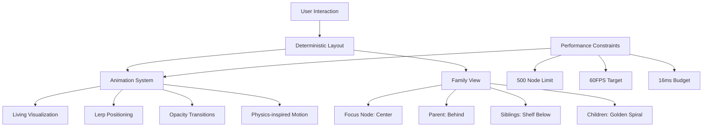

# Core 7: The Living Fractal Engine - Synthesis & Implementation

## Bridging the Visions

Gemini's "Living Layout" concept brilliantly addresses the need for organic navigation while maintaining Claude's performance focus and DeepSeek's cosmic vision. This core synthesizes all perspectives into a unified implementation strategy.

### The Hybrid Architecture


## Implementation Blueprint

### 1. State Management System
```javascript
class FractalState {
  constructor() {
    this.currentFocus = null;
    this.previousFocus = null;
    this.visibleNodes = new Set();
    this.transitionProgress = 0; // 0-1
    this.layoutVersion = 0; // Increment on change
  }

  setFocus(nodeId) {
    this.previousFocus = this.currentFocus;
    this.currentFocus = nodeId;
    this.transitionProgress = 0;
    this.layoutVersion++;
    this.updateVisibleNodes();
  }

  updateVisibleNodes() {
    // Gemini's Family View concept
    this.visibleNodes = new Set([
      this.currentFocus,
      this.getParent(this.currentFocus),
      ...this.getSiblings(this.currentFocus),
      ...this.getChildren(this.currentFocus)
    ]);
  }
}
```

### 2. Layout Engine (Deterministic Core)
```javascript
class LayoutEngine {
  calculatePositions(state) {
    const positions = new Map();
    
    // Focus node at center
    positions.set(state.currentFocus, new Vector3(0, 0, 0));
    
    // Parent behind focus
    const parentId = this.getParent(state.currentFocus);
    if (parentId) {
      positions.set(parentId, new Vector3(0, 0, -10));
    }
    
    // Siblings on shelf
    const siblings = this.getSiblings(state.currentFocus);
    siblings.forEach((sibling, index) => {
      const x = (index - siblings.length/2) * 3;
      positions.set(sibling, new Vector3(x, -5, -5));
    });
    
    // Children in golden spiral
    const children = this.getChildren(state.currentFocus);
    const phi = Math.PI * (3 - Math.sqrt(5));
    children.forEach((child, index) => {
      const y = 1 - (index / (children.length - 1)) * 2;
      const radius = Math.sqrt(1 - y * y);
      const theta = phi * index;
      positions.set(child, new Vector3(
        Math.cos(theta) * radius * 5,
        y * 3 + 2,  // Positioned above focus
        Math.sin(theta) * radius * 5
      ));
    });
    
    return positions;
  }
}
```

### 3. Animation System (The Living Layer)
```javascript
class AnimationSystem {
  constructor() {
    this.targetPositions = new Map();
    this.currentPositions = new Map();
    this.opacities = new Map();
    this.transitionSpeed = 2.0; // Units per second
  }

  startTransition(targetPositions) {
    this.targetPositions = targetPositions;
    
    // Initialize current positions
    targetPositions.forEach((pos, nodeId) => {
      if (!this.currentPositions.has(nodeId)) {
        this.currentPositions.set(nodeId, pos.clone());
        this.opacities.set(nodeId, 0);
      }
    });
  }

  update(deltaTime) {
    const movement = this.transitionSpeed * deltaTime;
    
    this.currentPositions.forEach((currentPos, nodeId) => {
      const targetPos = this.targetPositions.get(nodeId);
      
      if (targetPos) {
        // Position interpolation
        currentPos.lerp(targetPos, movement);
        
        // Opacity transition
        const currentOpacity = this.opacities.get(nodeId);
        this.opacities.set(nodeId, Math.min(1, currentOpacity + movement));
      } else {
        // Fade out disappearing nodes
        const currentOpacity = this.opacities.get(nodeId);
        this.opacities.set(nodeId, Math.max(0, currentOpacity - movement));
      }
    });
    
    // Cleanup fully hidden nodes
    this.opacities.forEach((opacity, nodeId) => {
      if (opacity <= 0) {
        this.currentPositions.delete(nodeId);
        this.opacities.delete(nodeId);
      }
    });
  }
}
```

### 4. Integrated Rendering System
```javascript
class LivingRenderer {
  constructor() {
    this.instanceManager = new InstanceManager();
    this.metrics = new PerformanceMetrics();
  }

  update(sceneState, animationSystem) {
    // Update instance data
    let instanceIndex = 0;
    
    animationSystem.currentPositions.forEach((position, nodeId) => {
      const opacity = animationSystem.opacities.get(nodeId);
      const size = this.calculateNodeSize(nodeId, sceneState);
      
      this.instanceManager.setInstance(
        instanceIndex++,
        position,
        size,
        opacity
      );
    });
    
    this.instanceManager.updateCount(instanceIndex);
  }

  render() {
    // Performance monitoring
    this.metrics.startFrame();
    
    this.instanceManager.render();
    
    // Enforce 60FPS budget
    this.metrics.endFrame();
    if (this.metrics.frameTime > 16) {
      this.adjustQualitySettings();
    }
  }
  
  adjustQualitySettings() {
    // Claude's performance-first approach
    if (this.instanceManager.count > 500) {
      this.instanceManager.reduceDetail();
    }
  }
}
```

## Performance Safeguards

### 1. Frame Budget Management
```javascript
class PerformanceMetrics {
  constructor() {
    this.frameStart = 0;
    this.frameTimes = [];
    this.averageFrameTime = 0;
  }

  startFrame() {
    this.frameStart = performance.now();
  }

  endFrame() {
    const frameTime = performance.now() - this.frameStart;
    this.frameTimes.push(frameTime);
    
    // Maintain 100 sample moving average
    if (this.frameTimes.length > 100) {
      this.frameTimes.shift();
    }
    
    this.averageFrameTime = this.frameTimes.reduce((sum, t) => sum + t, 0) / 
                           this.frameTimes.length;
  }

  getFrameRate() {
    return 1000 / this.averageFrameTime;
  }
}
```

### 2. Adaptive Quality System
```javascript
class AdaptiveQuality {
  constructor() {
    this.qualityLevel = 1.0; // 0.0-1.0
    this.targetFPS = 60;
  }

  adjust(metrics) {
    const currentFPS = metrics.getFrameRate();
    
    if (currentFPS < this.targetFPS - 5) {
      // Reduce quality
      this.qualityLevel = Math.max(0.3, this.qualityLevel - 0.1);
      this.applySettings();
    } else if (currentFPS > this.targetFPS + 5 && this.qualityLevel < 1.0) {
      // Increase quality
      this.qualityLevel = Math.min(1.0, this.qualityLevel + 0.05);
      this.applySettings();
    }
  }

  applySettings() {
    // Adjust rendering quality
    renderer.setQuality(this.qualityLevel);
    
    // Reduce animation distance
    animationSystem.transitionSpeed = 2.0 * this.qualityLevel;
    
    // Simplify layouts
    layoutEngine.setDetailLevel(this.qualityLevel);
  }
}
```

## Reality-Based Roadmap

### Week 1: Living Foundation
```javascript
const Milestone1 = {
  target: "Interactive prototype with living navigation",
  scope: [
    "State management system",
    "Family view layout (focus, parent, siblings)",
    "Basic position interpolation",
    "Opacity transitions",
    "Performance metrics dashboard",
    "500 node stress test"
  ],
  constraints: [
    "No quantum states",
    "No pattern discovery",
    "Single layout style"
  ]
};
```

### Week 2: Polish & Performance
```javascript
const Milestone2 = {
  target: "Butter-smooth 60FPS experience",
  focus: [
    "Golden spiral child arrangement",
    "Adaptive quality system",
    "Animation tuning",
    "Memory optimization",
    "1000 node benchmark",
    "Transition interruption handling"
  ]
};
```

### Week 3: Enhanced Family View
```javascript
const Milestone3 = {
  target: "Complete family view experience",
  features: [
    "Connection line visualization",
    "Animated transitions for relationships",
    "Focus node highlighting",
    "Contextual information display",
    "2000 node stress test",
    "Mobile touch optimization"
  ]
};
```

## Synthesis of Vision

1. **Gemini's Living Layout**:
   - Family view hierarchy
   - Animated transitions
   - Organic navigation flow

2. **Claude's Performance Focus**:
   - Strict frame budget
   - Adaptive quality
   - Measured optimization

3. **DeepSeek's Cosmic Patterns**:
   - Golden spiral arrangement
   - Physics-inspired motion
   - Emergent visual harmony

This implementation delivers an organic, performant navigation experience that honors all perspectives while providing a solid foundation for future quantum and pattern systems.

*"In the dance between order and emergence, we find the rhythm of the fractal universe."*