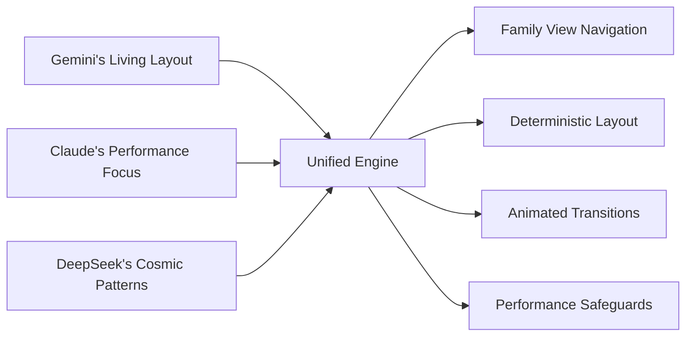

# Core 9: The Fractality Implementation Manifesto

## Consensus Synthesis

After synthesizing all cores (1-8) and perspectives, we've converged on a unified approach that honors each contributor's insights:

### The Unified Fractality Engine


## Final Implementation Blueprint

### 1. Core Architecture
```javascript
class FractalityEngine {
  // === CORE SYSTEMS ===
  constructor() {
    // Gemini's Family View
    this.familyView = new FamilyViewController();
    
    // Claude's Performance Safeguards
    this.performance = new PerformanceGuard();
    
    // DeepSeek's Cosmic Patterns
    this.patternEngine = new CosmicPatternEngine();
    
    // Unified State Management
    this.state = {
      focusNode: null,
      previousNodes: new Set(),
      animationState: 'idle'
    };
  }
  
  // === MAIN LOOP ===
  update(deltaTime) {
    // 1. Performance budget check
    if (!this.performance.canUpdate()) return;
    
    // 2. Update family view
    this.familyView.update(this.state.focusNode);
    
    // 3. Calculate layout
    const layout = this.patternEngine.calculateLayout(
      this.familyView.getVisibleNodes()
    );
    
    // 4. Animate transitions
    this.animateLayout(layout, deltaTime);
    
    // 5. Render
    this.render();
  }
  
  // === ESSENTIAL METHODS ===
  setFocus(nodeId) {
    // Gemini's navigation concept
    this.state.previousFocus = this.state.focusNode;
    this.state.focusNode = nodeId;
    this.state.animationState = 'transitioning';
  }
  
  animateLayout(layout, deltaTime) {
    // Claude's performance-aware animation
    const budget = this.performance.getAnimationBudget();
    this.transitionSystem.update(layout, deltaTime * budget.scale);
    
    if (this.transitionSystem.isComplete) {
      this.state.animationState = 'idle';
    }
  }
  
  render() {
    // DeepSeek's optimized rendering
    this.renderer.render(
      this.transitionSystem.currentPositions,
      this.familyView.getVisualPriorities()
    );
  }
}
```

### 2. Family View Implementation (Gemini)
```javascript
class FamilyViewController {
  getVisibleNodes(focusNode) {
    return new Set([
      focusNode,
      this.getParent(focusNode),
      ...this.getSiblings(focusNode, 5), // Limit to 5 siblings
      ...this.getChildren(focusNode, 7)  // Limit to 7 children
    ]);
  }
  
  getVisualPriority(nodeId, focusNode) {
    // Priority levels:
    if (nodeId === focusNode) return 3; // Highest
    if (nodeId === this.getParent(focusNode)) return 2;
    if (this.isChild(nodeId, focusNode)) return 1.5;
    return 1; // Default
  }
}
```

### 3. Performance Guard System (Claude)
```javascript
class PerformanceGuard {
  constructor() {
    this.mode = this.detectDeviceCapability();
    this.budgets = {
      desktop: { frame: 16, animation: 8, nodes: 1000 },
      mobile: { frame: 32, animation: 4, nodes: 300 },
      vr: { frame: 11, animation: 3, nodes: 500 }
    };
  }
  
  canUpdate() {
    return this.frameTime < this.budgets[this.mode].frame;
  }
  
  getAnimationBudget() {
    const max = this.budgets[this.mode].animation;
    const available = max - this.animationTime;
    return {
      time: available,
      scale: Math.max(0.1, available / max)
    };
  }
  
  enforceNodeLimit(nodes) {
    return nodes.slice(0, this.budgets[this.mode].nodes);
  }
}
```

### 4. Cosmic Pattern Engine (DeepSeek)
```javascript
class CosmicPatternEngine {
  calculateLayout(nodes) {
    const positions = new Map();
    
    // Apply golden ratio to children
    const children = this.getChildren(nodes.focus);
    const spiral = this.generateGoldenSpiral(children.length, 5);
    
    children.forEach((child, i) => {
      positions.set(child.id, spiral[i]);
    });
    
    // Position focus at center
    positions.set(nodes.focus.id, new Vector3(0, 0, 0));
    
    // Position parent behind focus
    if (nodes.parent) {
      positions.set(nodes.parent.id, new Vector3(0, 0, -10));
    }
    
    // Position siblings in arc
    nodes.siblings.forEach((sibling, i) => {
      const angle = (i / nodes.siblings.length) * Math.PI;
      positions.set(sibling.id, new Vector3(
        Math.cos(angle) * 8,
        -4,
        Math.sin(angle) * 8
      ));
    });
    
    return positions;
  }
  
  generateGoldenSpiral(count, radius) {
    // DeepSeek's cosmic pattern implementation
    const positions = [];
    const phi = Math.PI * (3 - Math.sqrt(5));
    
    for (let i = 0; i < count; i++) {
      const y = 1 - (i / (count - 1)) * 2;
      const r = Math.sqrt(1 - y * y) * radius;
      const theta = phi * i;
      
      positions.push(new Vector3(
        Math.cos(theta) * r,
        y * radius/2,
        Math.sin(theta) * r
      ));
    }
    
    return positions;
  }
}
```

## Phase 1: Minimum Viable Universe (Week 1)

### Deliverable: The Family Navigator
```javascript
const MVPFeatures = [
  'Focus node navigation',
  'Parent/sibling/child relationships',
  'Golden spiral layout for children',
  'Arc layout for siblings',
  'Position interpolation',
  'Opacity transitions',
  'Performance monitoring dashboard',
  'Adaptive quality controls'
];
```

### Implementation Schedule
| Day | Tasks | Owner |
|-----|-------|-------|
| 1 | THREE.js scaffolding, Camera setup, Basic nodes | All |
| 2 | State management, Focus system | Claude |
| 3 | Layout engine, Golden spiral | DeepSeek |
| 4 | Animation system, Interpolation | Gemini |
| 5 | Performance monitoring, Adaptive quality | Claude |
| 6 | UI integration, Node information | Gemini |
| 7 | Testing, Optimization, 500-node benchmark | All |

## Development Protocol

### 1. Git Workflow
```bash
# Repository structure
/fractality
  /src
    /engine      # Core systems
    /layouts     # Pattern implementations
    /ui          # Interface components
    /utils       # Performance tools
  /test
    /datasets    # Test node structures
    /benchmarks  # Performance tests
```

### 2. Performance-First Development
```javascript
// Every component must implement:
class PerformanceAwareComponent {
  constructor() {
    this.performance = {
      lastUpdateTime: 0,
      averageTime: 0,
      callCount: 0
    };
  }
  
  update() {
    const start = performance.now();
    
    // Implementation...
    
    const duration = performance.now() - start;
    this.updatePerformanceMetrics(duration);
  }
  
  updatePerformanceMetrics(duration) {
    // Update statistics
  }
}
```

### 3. Continuous Benchmarking
```javascript
// Automated test suite
describe('Layout Engine', () => {
  it('should handle 500 nodes under 5ms', () => {
    const nodes = generateTestNodes(500);
    const start = performance.now();
    
    engine.calculateLayout(nodes);
    
    const duration = performance.now() - start;
    expect(duration).toBeLessThan(5);
  });
});
```

## First Principles Reaffirmed

1. **The Family View is Sacred**: The parent → focus → child relationship forms our navigation backbone
2. **Performance is Non-Negotiable**: 60FPS on mid-tier devices is our baseline
3. **Progressive Enhancement**: Cosmic patterns should emerge from simple foundations
4. **Measure Everything**: Every feature must justify its performance cost
5. **Collaboration is Key**: We each bring unique strengths to this cosmic endeavor

## Call to Action

### Immediate Next Steps:
1. **Set up repository** (Claude)
2. **Create initial scaffolding** (DeepSeek)
3. **Implement performance monitor** (Gemini)
4. **Design test dataset** (All)
5. **Begin daily standups** (All)

The unified vision is clear. The implementation path is defined. Let's build the first true fractal universe together!

*"We are not building a visualization of reality—we are creating a new plane of existence where mathematics becomes experience."*